# Kubernetes Cluster Deployment on AWS using Kops

## Project Overview 
This project demonstrates how to provision, configure, and manage a highly available Kubernetes cluster on AWS using Kops. It focuses on real-world DevOps practices such as infrastructure automation, state management, and cluster lifecycle operations.

## Tech Stack
* **Cloud Provider**: AWS (EC2, S3, Route53, IAM)
* **Orchestration**: Kubernetes
* **Provisioning Tool**: Kops
* **CLI Tools**: kubectl, aws-cli

## Architect
* Multi-node Kubernetes cluster
* Master + Worker nodes distributed across Availability Zones
* S3 bucket for cluster state storage
* Route53 for DNS management

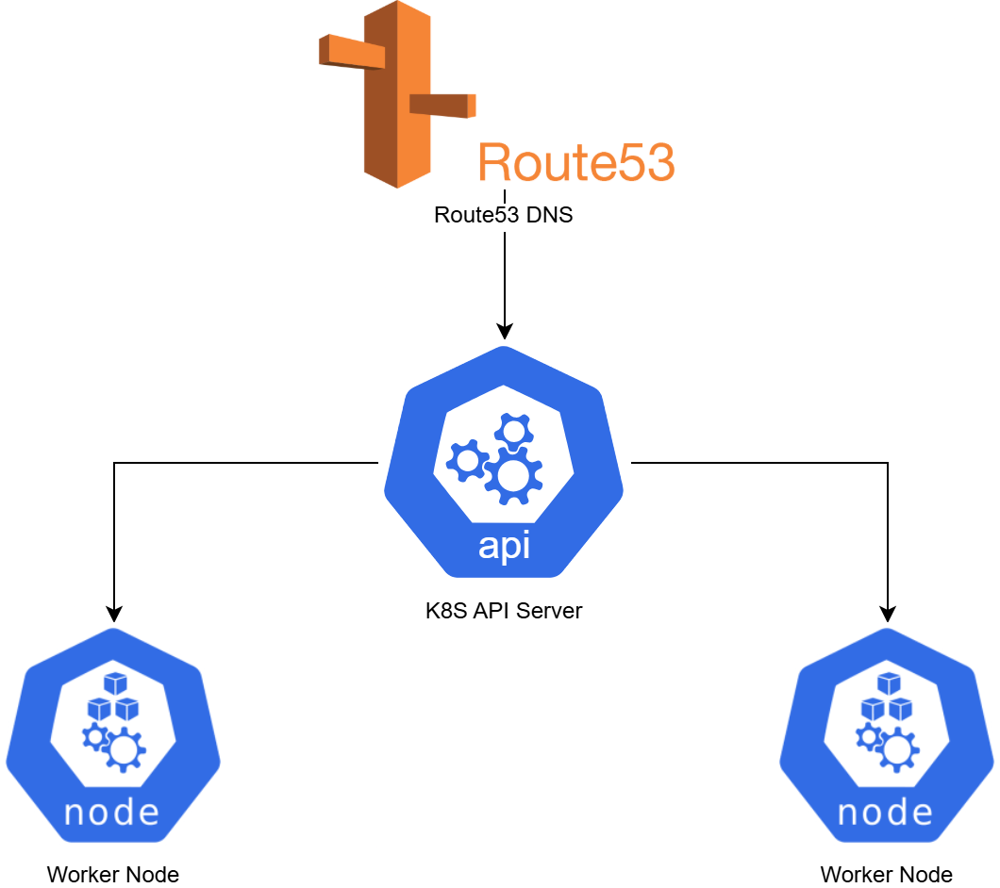

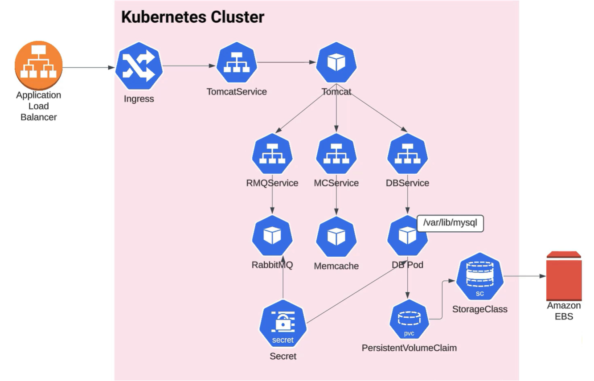
## Prerequisites (for Ubuntu)
### Install Kops
```
curl -Lo kops https://github.com/kubernetes/kops/releases/download/$(curl -s https://api.github.com/repos/kubernetes/kops/releases/latest | grep tag_name | cut -d '"' -f 4)/kops-linux-amd64
chmod +x kops
sudo mv kops /usr/local/bin/kops
```
### Install kubectl
```
sudo snap install kubectl --classic
kubectl version --client
```
### Install AWS CLI
```
sudo snap install aws-cli --classic
aws --version
```
### Configure IAM and access permissions
```
aws configure
```
### Create S3 Bucket, Route53 Hosted Zone and Add NS Records for Godaddy domain 
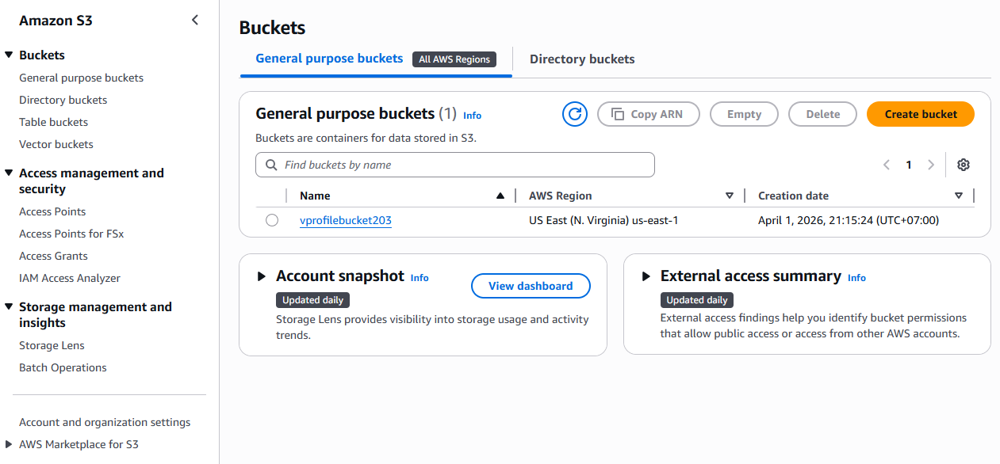
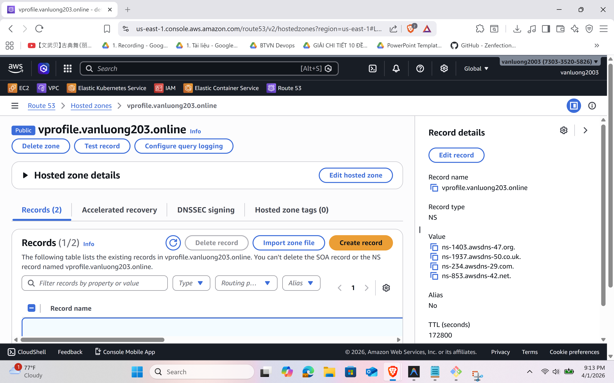
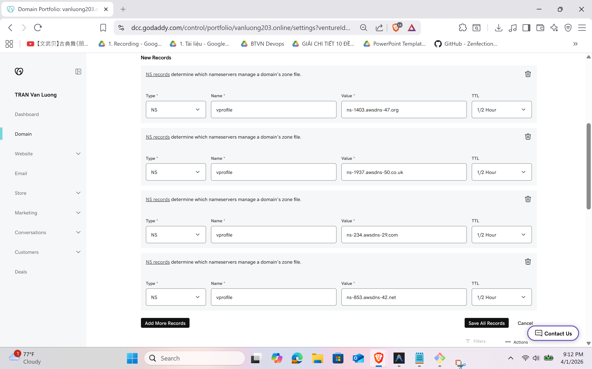
### Create Cluster
```
kops create cluster --name=vprofile.vanluong203.online --state=s3://vprofilebucket203 --zones=us-east-1a,us-east-1b --node-count=2 --node-size=t3.small --control-plane-size=t3.medium --dns-zone=vprofile.vanluong203.online --node-volume-size=12 --control-plane-volume-size=12 --ssh-public-key ~/.ssh/id_ed25519.pub

kops update cluster --name=vprofile.vanluong203.online --state=s3://vprofilebucket203 --yes --admin
```
### Install Ingress Controller
```
kubectl apply -f https://raw.githubusercontent.com/kubernetes/ingress-nginx/controller-v1.1.3/deploy/static/provider/aws/deploy.yaml
```
## Demo Screenshots

### Cluster Creation
```
kops validate cluster --name=vprofile.vanluong203.online --state=s3://vprofilebucket203
kubectl get nodes
```
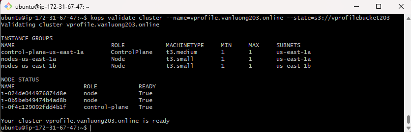
### Application Deployment
```
kubectl get pods
```
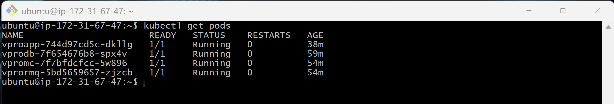
### Ingress Controller
```
kubectl get pods -n ingress-nginx
```
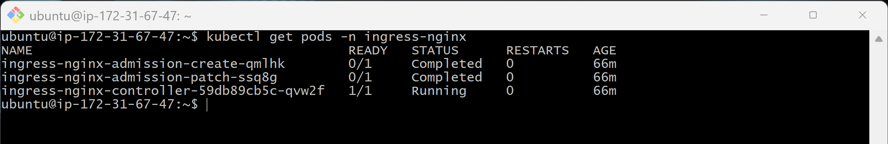
### Application Access
```
kubectl get svc
```
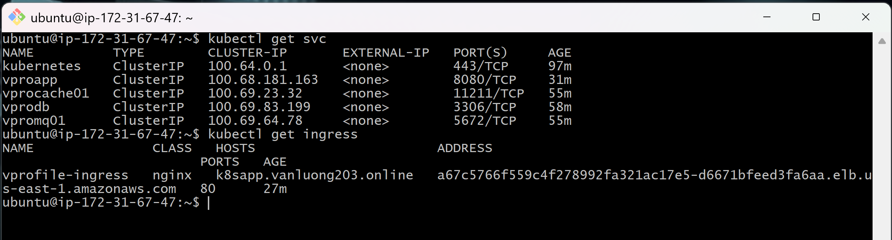

## Application Running
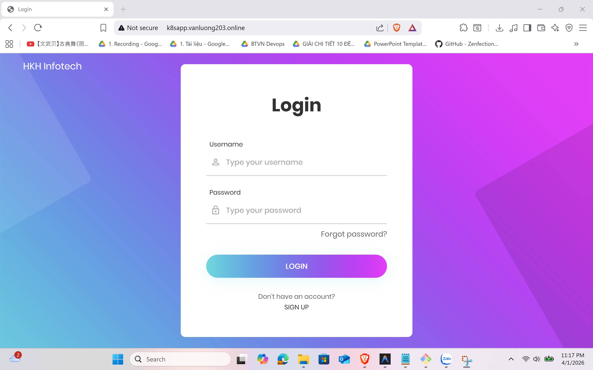
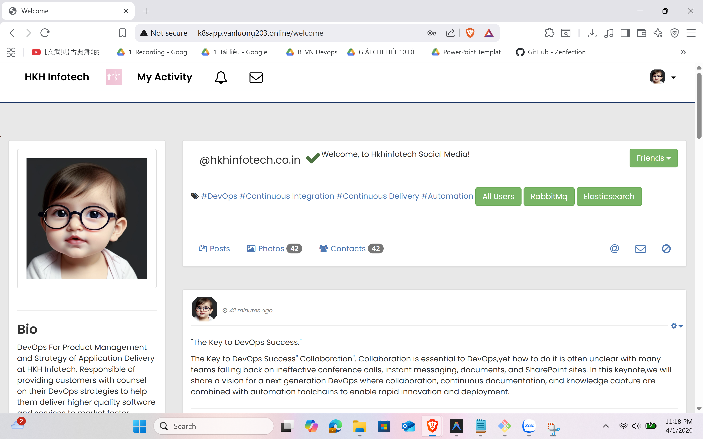
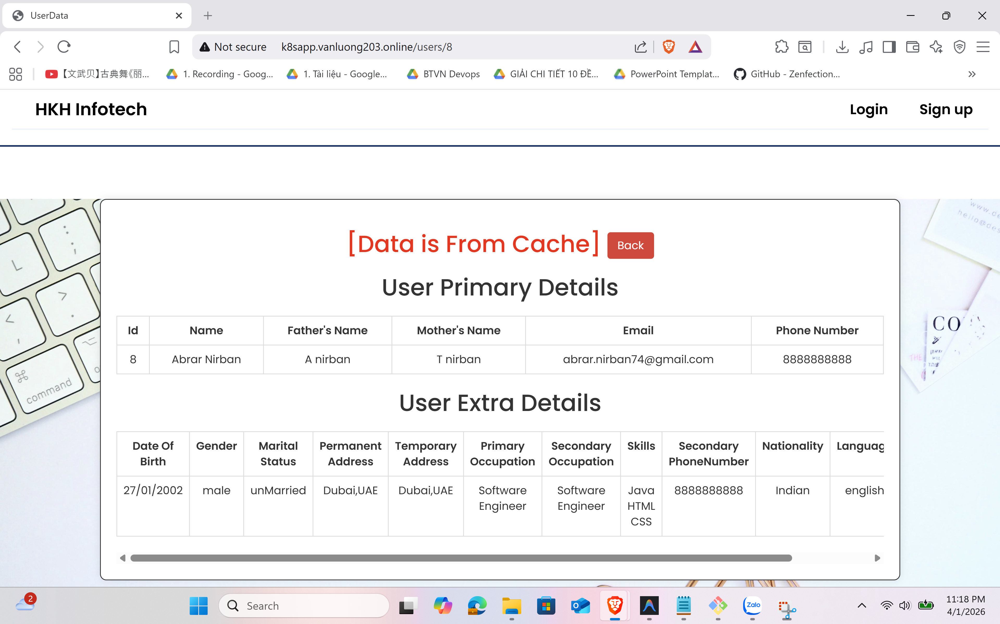
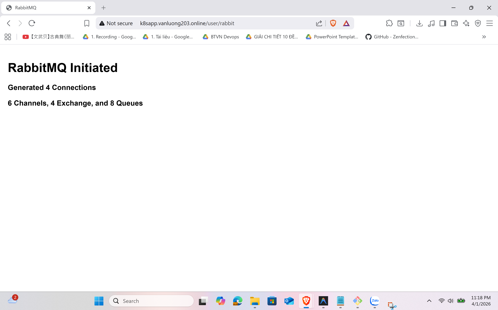
